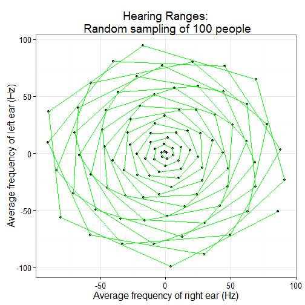
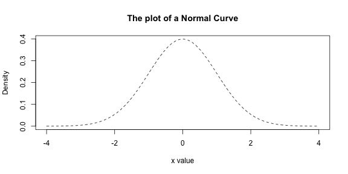

<style type="text/css">
title {
  font-size:40px;
}
body {
   font-size: 18px;
}
pre {
  font-size: 14px
}
</style>

## <p align="center">Lab 4  What would the world be like if the Normal Curve had never been discovered?</p>
==
 <p align="center">Shaowei Ding, Jie Liu, Justin Zwolski, Lindsay Rutter </p>
 <p align="center">(Four dreadfully normal authors)</p>

One day, the Earth ventured a wee-bit too close to a blackhole, and all
the normalness it once enjoyed was sucked away forever.

This left the world a mess, as though its blueprint came from a two-year old wielding a purple crayon: 


```r
library(ggplot2)
logic <- runif(60, 1, 100)
sanity <- runif(60, 1, 100)
qplot(logic, sanity, geom = "path", xlab = "Logic", ylab = "Sanity", main = "The World - By Tiny Tim") + 
    theme(legend.position = "none") + geom_path(colour = "purple")
```

 


Intelligent designer of the new and abnormal planet Earth (on right).  
(aka. My cousin after ingesting a purple crayon!)

Variables that once followed a normal curve now followed an abnormal spiral into doom!
For instance, audio frequency ranges between people were now so un-normalized that
many people could hardly hear each other anymore...


```r
t = c(1:100)
x = t * cos(t)
y = t * sin(t)
qplot(x, y, xlab = "Average frequency of right ear (Hz)", ylab = "Average frequency of left ear (Hz)", 
    geom = "point", main = "Hearing Ranges:\n Random sampling of 100 people") + 
    geom_path(colour = "green")
```

 


Statistics professors were mortified because they could no longer organize human height
as a normal distribution - a textbook example for many years. Instead, human variability
of height was so random, it seemed that everyone's height was abnormal nowadays: 


```r
x = c(1:100)
y = seq(1, 1000, 10)
qplot(x, y, geom = "bar", xlab = "Person", ylab = "Height (ft)", main = "Utter Abnormality:\n Random sampling of 100 people", 
    stat = "identity", fill = as.factor(x)) + theme(legend.position = "none")
```

 


With people randomly between 1 to 1,000 feet tall, the real-estate business slumped into a chatoic terror:


1. The plot of a normal curve

```r
x <- seq(-4, 4, length = 100)
hx <- dnorm(x)
plot(x, hx, type = "l", lty = 2, xlab = "x value", ylab = "Density", main = "The plot of a Normal Curve")
```




You can also embed plots, for example:


