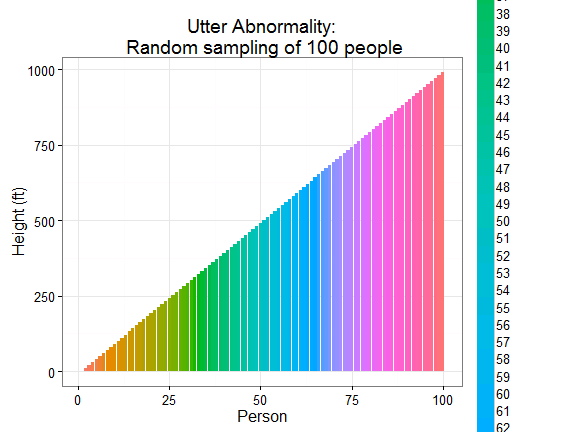

<style type="text/css">
title {
  font-size:40px;
}
body {
   font-size: 18px;
}
pre {
  font-size: 14px;
}

</style>


## <p align="center">Lab 4  What would the world be like if the Normal Curve had never been discovered?</p>
==
 <p align="center">Shaowei Ding, Jie Liu, Justin Zwolski, Lindsay Rutter </p>
 <p align="center">(Four dreadfully normal authors)</p>

One day, while a German mathematician was about to make a historic discovery, the Earth ventured a wee-bit too close to a blackhole, and all knowledge in the world was suddenly distorted.

This left the world a mess, as though its blueprint came from a two-year old wielding a purple crayon: 


```r
library(ggplot2)
logic <- runif(60, 1, 100)
sanity <- runif(60, 1, 100)
qplot(logic, sanity, geom = "path", xlab = "Logic", ylab = "Sanity", main = "The World - By Tiny Tim") + 
    theme(legend.position = "none") + geom_path(colour = "purple") + theme_bw(base_size = 16)
```


Intelligent designer of the new and abnormal planet Earth (on right).  
(aka. My cousin after ingesting a purple crayon!)

Audio frequency ranges between people went completely crazy that many people could
hardly hear each other anymore...


```r
t = c(1:100)
x = t * cos(t)
y = t * sin(t)
qplot(x, y, xlab = "Average frequency of right ear (Hz)", ylab = "Average frequency of left ear (Hz)", 
    geom = "point", main = "Hearing Ranges:\n Random sampling of 100 people") + 
    geom_path(colour = "green") + theme_bw(base_size = 16)
```


There was a drastic change in human height, which gave statistics professors nightmares. The data just did not make any sense, as human variability in height became so random:


```r
x = c(1:100)
y = seq(1, 1000, 10)
qplot(x, y, geom = "bar", xlab = "Person", ylab = "Height (ft)", main = "Utter Abnormality:\n Random sampling of 100 people", 
    stat = "identity", fill = as.factor(x)) + theme(legend.position = "none") + 
    theme_bw(base_size = 16)
```




With people randomly between 1 to 1,000 feet tall, the real-estate business slumped into a chatoic terror:


Foreclosures went through the roof, and banks were hit extremely hard, as stocks took a complete nosedive. A depression was imminent, and the public became more and more distressed with the bigwigs in the nation's capital.

Metabolism of living beings was totally altered. The curve of birth and death started to change, and overall population inicreased to 10 billion in 5 years. Aging is even faster than before, which led the population pyramid to be left skewed: 50 percent of people on the earth are over 80 years old.


However, it turns out that this chaos was created by the object Pluto:


Once every nation on Earth recognized Pluto as a planet, everything changed, and the Earth somehow escaped from the blackhole.

To be continued...

